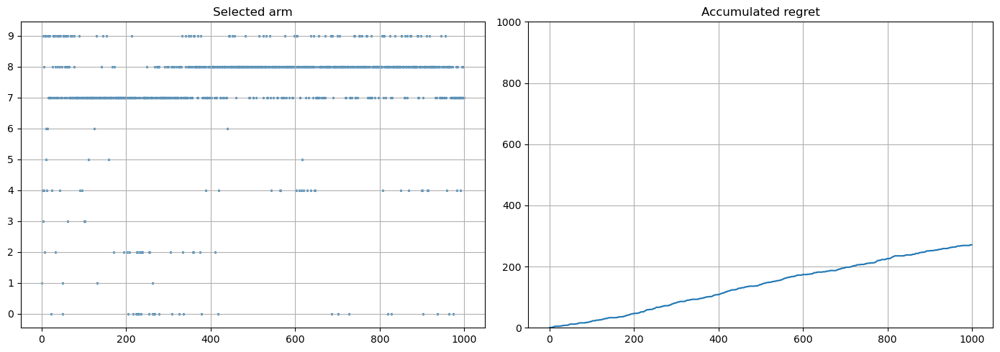

# Multi-armet-Bandit
Solving the problem of Exploitation-Exploration in the problem of non-contextual bandits using different basic algorithms.

>Implemented:  
>- e-greedy  
>- SoftMax  
>- UBC  
>- Tompson Sampling  

The hand selection story and accumulated regret of the **Thompson Sampling** algorithm:

_You can study in more detail and see other metric in the [file](./algorithms.ipynb)_